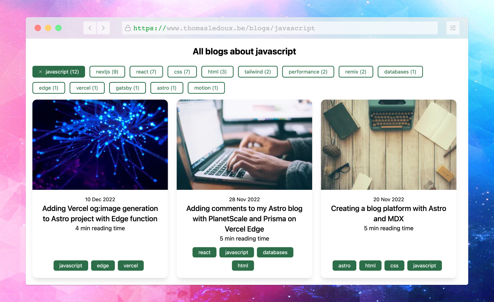

With the launch of [Astro 2.0](https://astro.build/blog/astro-2/), the [Content Collections API](https://astro.build/blog/introducing-content-collections/) became available.
This makes it very easy to query your Markdown/MDX in a type safe matter (and much more, make sure to read the blogpost I linked above).
Setting it up was really easy for my blog, I just had to move my blogs from `/pages/blog` to `/content/blog` and add a `/content/config.ts` file.
The `/content` folder is a reserved folder to be used for Content Collections.
In the `/content/config.ts` file you define the schema(s) for the collections you want to create.
At the moment I just have 1 collections, namely my blog.
So I created my schema as follows:

```typescript title="src/content/config.ts"
import { z, defineCollection } from "astro:content";

const blog = defineCollection({
  schema: z.object({
    title: z.string(),
    layout: z.string(),
    tags: z.array(z.string()),
    date: z.string(),
    image: z.string().optional(),
  }),
});

export const collections = {
  blog,
};
```

As you can see, `tags` are a required property for all of my blogs, luckily I added tags to every blogpost from the start.
In my MDX the tags are defined like this at the top of the file:

```astro
---
tags: ["javascript", "edge", "vercel"];
---
```

Now I have the blog collection defined in my config, I can start working with the data in my `.astro` files.
I want to create a separate page for every unique tag which is used in my blogs.
To make this possible, I simply added a file `/pages/blog/tags/[...slug].astro` (this is a [dynamic route](https://docs.astro.build/en/core-concepts/routing/#static-ssg-mode)).
In this file, I want to fetch all the blogs from my collection, find the unique tags, and generate a URL for each one of them.
The `getStaticPaths()` function will return the URLs I want to have prerendered during build time (hence the `export const prerender = true;` line).

```astro title="src/pages/blog/tags/[...slug].astro"
---
export const prerender = true;
const { slug } = Astro.params;
import { getCollection } from "astro:content";
const blogs = await getCollection("blog");
const tags = blogs
  .map((blog) => blog.data.tags)
  .flat()
  .reduce<{ [key: string]: number }>(function (result, c) {
    var count = result[c] || 0;
    result[c] = count + 1;
    return result;
  }, {});
export async function getStaticPaths() {
  const blogs = await getCollection("blog");
  return [...new Set(blogs.map((blog) => blog.data.tags).flat())].map(
    (tag) => ({
      params: { slug: tag },
    }),
  );
}
if (!slug) {
  return Astro.redirect("/404");
}
const allBlogPostsWithTag = await getCollection("blog", (blog) =>
  blog.data.tags.some((tag) => tag === slug),
);
if (allBlogPostsWithTag.length === 0) {
  return Astro.redirect("/404");
}
---
```

I used a `.reduce()` function to calculate the amount of blogs I have available per tag, so I can display this at the top of my tag pages.
The API provided by Content Collections is the `getCollection()` function, this allows me to fetch all the blogs in my `blogs` collection. As you can see it's also possible to pass a filter function to this function, which I used to only fetch the blogs which contain the tag for which the current page is generated on line 22.
The actual rendering is simple, I can now use the `allBlogPostsWithTag` variable and render the blog posts.
Since the `slug` matches the tag this page is generated for, I can just use this slug in my title/description/..

```astro title="src/pages/blog/tags/[...slug].astro"
<Layout
  title={`The Thomas Ledoux blog | ${slug}`}
  description={`All blogs about ${slug}`}
>
  <section>
    <h1 class="text-center text-2xl font-bold mb-6">
      All blogs about {slug}
    </h1>
    <Tags tags={tags} slug={slug} />
    <div
      class="grid sm:grid-cols-2 lg:grid-cols-3 gap-6 items-center auto-rows-min mt-4"
    >
      {
        allBlogPostsWithTag.map(async (post, i) => {
          const { remarkPluginFrontmatter } = await post.render();

          return (
            <PostPreview
              minutesRead={remarkPluginFrontmatter?.minutesRead}
              post={post}
              index={i}
            />
          );
        })
      }
    </div>
  </section>
</Layout>
```

The result of this tag page will look like this:



I must say I really enjoy working with Astro for writing Markdown/MDX, especially when they make it this easy!  
Source code can be found on [Github](https://github.com/thomasledoux1/website-thomas-astro).  
An example of a tag page can be found [here](https://www.thomasledoux.be/blog/tags/javascript).
