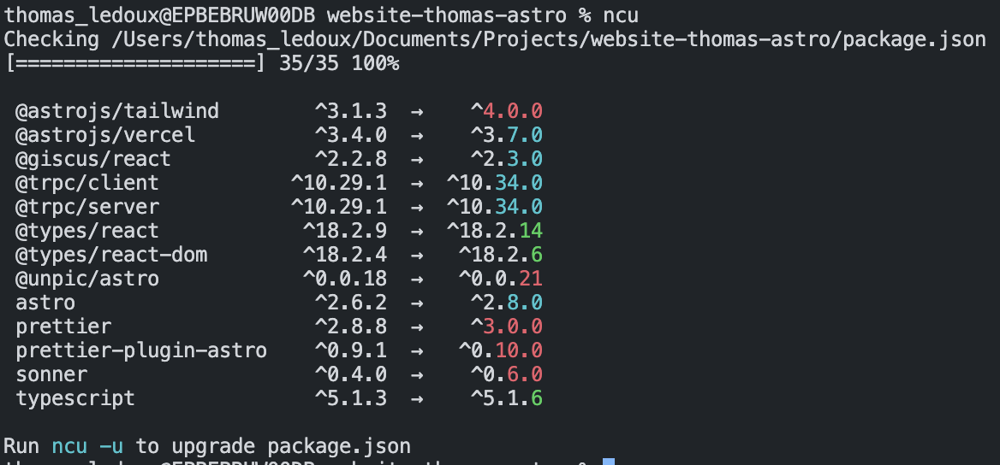

## Why?

Keeping your dependencies up to date is important because it helps you keep your application secure and up to date with the latest features. It also helps you avoid the situation where you have to update a dependency that is 3 years old and has 100 breaking changes.
Using a tool like `npm-check-updates` helps you keep your dependencies up to date and makes it easier to update them, without having to manually go through all your dependencies in your package.json file.

## How?

To install `npm-check-updates`, run `npm install -g npm-check-updates`. This will install the tool globally on your machine, making sure you can use the tool in any project.
To run the tool, run `ncu` in the root of your project. This will show you a list of all your dependencies and their current version and the latest version available.
The output will look something like this:

  
Notice in the output that different colors are used to indicate the type of
update that is available:

- Green means that a patch update is available
- Yellow means that a minor update is available
- Red means that a major update is available

Running `ncu -u` will output the same list, but with the updated versions of the dependencies. This will also update the dependencies in your package.json & package-lock.json. Now all you have to do afterwards is to run `npm install` to install the updated dependencies.

Another thing I find useful in this tool is the fact that you can use the --filter flag to filter the dependencies you want to update, for example `ncu --filter @babel` will only show you the dependencies that start with `@babel`.

There's also an option to only go an update 'patch' or 'minor' versions of your dependencies, this can be done by using the `--target` flag, for example `ncu --target minor` will only update your dependencies to the latest minor version.

Of course there's even more options to use in this tool, you can find them all in the [documentation](https://www.npmjs.com/package/npm-check-updates).

## Conclusion

If you're looking for a better workflow of keeping the dependecies of your projects up to date, I would definitely recommend using `npm-check-updates`. It's a great tool that helps you keep your dependencies up to date and makes it easier to update them with a visual output.
