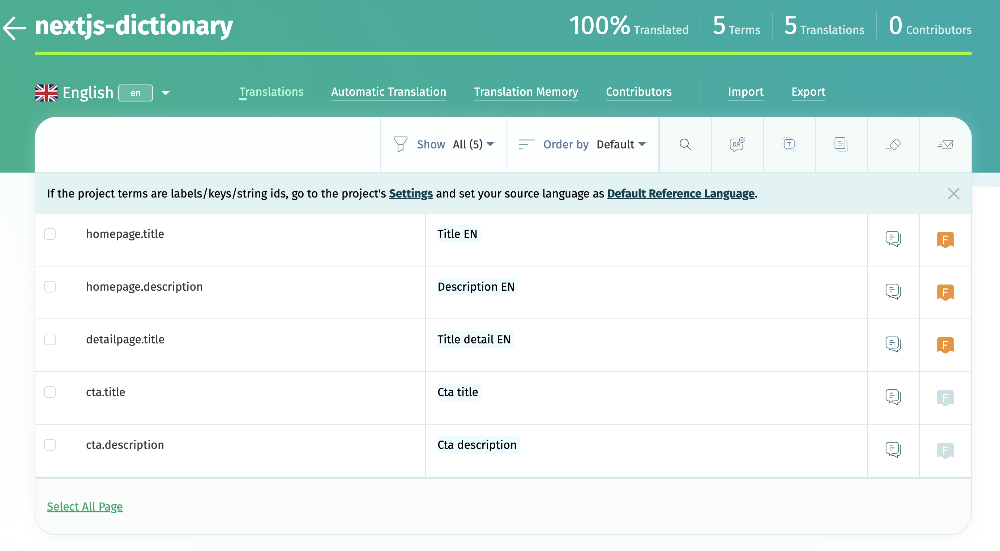

## TLDR:

[Source code](https://github.com/thomasledoux1/simple-dictionary-nextjs) &
[Live demo](https://simple-dictionary-nextjs.vercel.app/)

## Introduction

I've been doing some web speed performance checks on the Next.js websites we are building at my current company lately, and one of the things that I noticed is that the translation system we are using is adding a lot of weight to the bundle size. I decided to create a minimal translation system that doesn't add any dependencies to the bundle size.
Of course this is no shade to the existing translation systems out there, but I wanted to see if I could create something that is minimal and dependency-free, without all the functionality which systems like [next-intl](https://next-intl-docs.vercel.app/) provide.

## Setting up the backend

For the purpose of this blog and demo I decided to use [POEditor](https://poeditor.com/) to host my translations.
They have a generous free tier which is more than enough for this demo.
I created a project, added 2 languages (NL and EN) and added a few translations to it.



## Setting up the frontend

Getting started with a new Next.js app is easy, just run `npx create-next-app`, follow the steps in your terminal and you're good to go.
For this demo and blog I'm using the Pages Router, I might do another blog post on doing the same in the App Router later, but this might work a bit differently since React Context can not be used in RSC.
In `next.config.js` I added

```js
i18n: {
  defaultLocale: 'en',
  locales: ['en', 'nl'],
},
```

to add an extra language (Dutch) to the project.

### Setting up the translation fetching from POEditor

Using the Fetch API, I'm fetching the translations for my project from POEditor in the specified language.
I'm creating an object with the translations, where the key is the translation key and the value is the translation itself.

```ts title="lib/api.ts"
export const getDictionaryItems = async (locale: string) => {
  const urlencoded = new URLSearchParams();
  urlencoded.append("id", process.env.POEDITOR_PROJECT_ID!);
  urlencoded.append("api_token", process.env.POEDITOR_API_TOKEN!);
  urlencoded.append("language", locale);
  const dictionaryItems = await fetch(
    "https://api.poeditor.com/v2/terms/list",
    {
      method: "POST",
      body: urlencoded,
    },
  ).then((res) => res.json());
  const terms = dictionaryItems.result.terms as {
    term: string;
    translation: {
      content: string;
    };
  }[];
  return Object.fromEntries(
    terms.map((el) => [el.term, el.translation.content]),
  );
};
```

### Setting up the translation context

Here I'm creating a React Context to store the translations.

```ts title="lib/dicationary-context.ts"
import { createContext } from "react";

export const DictionaryContext = createContext<
  Record<string, string> | undefined | null
>(null);
```

### Setting up the translation provider

In the `_app.tsx` file (the entrypoint of the Next.js app) I'm importing my `DictionaryContext`, and using it's `Provider` to provide the translations to all the pages in my app by wrapping everything in the render function in the `Provider`.
The `DictionaryContext.Provider` takes a `value` prop, which should be the translations coming from POEditor. I fill the value with `pageProps.dictionaryItems`, which will be provided by the `getStaticProps` (or `getServersideProps`) function in the pages.

```ts title="pages/_app.tsx"
import '@/styles/globals.css';
import type { AppProps } from 'next/app';
import { Inter } from 'next/font/google';
const inter = Inter({ subsets: ['latin'] });
import { DictionaryContext } from '../lib/dictionary-context';
import Link from 'next/link';
import { useRouter } from 'next/router';

export default function App({ Component, pageProps }: AppProps) {
  const router = useRouter();
  return (
    <DictionaryContext.Provider value={pageProps.dictionaryItems}>
      <header className="flex justify-center">
        <nav>
          <ul className="flex py-4 gap-x-4">
            <li>
              <Link
                className={`p-2 border ${
                  router.asPath === '/' ? 'border-orange-500' : ''
                }`}
                href="/"
              >
                Home
              </Link>
            </li>
            <li>
              <Link
                className={`p-2 border ${
                  router.asPath === '/detail' ? 'border-orange-500' : ''
                }`}
                href="/detail"
              >
                Detailpage
              </Link>
            </li>
          </ul>
        </nav>
        <div className="fixed top-4 right-4">
          <Link
            className={`${
              router.locale === 'en' ? 'text-orange-500 font-bold' : ''
            }`}
            href={router.asPath}
            locale="en"
          >
            EN
          </Link>
          <Link
            className={`ml-2 ${
              router.locale === 'nl' ? 'text-orange-500 font-bold' : ''
            }`}
            href={router.asPath}
            locale="nl"
          >
            NL
          </Link>
        </div>
      </header>
      <main className={inter.className}>
        <Component {...pageProps} />
      </main>
    </DictionaryContext.Provider>
  );
}
```

### Setting up the translation hook

For my custom translation hook I'm using the `useContext` hook to get the translations from the `DictionaryContext` and return the translation for the given key. I also added a second parameter to the function, which is an object containing variables which can be used in the translation. The translation should contain the variable name between double curly braces, and the variable will be replaced with the value passed to the translation function.

```ts title="hooks/use-translation.ts"
import { useContext } from "react";
import { DictionaryContext } from "../lib/dictionary-context";

const useTranslation = () => {
  const translations = useContext(DictionaryContext);
  const t = (
    key: string,
    variables?: {
      [key: string]: string | number;
    },
  ) => {
    if (!translations) {
      return key;
    }
    if (variables) {
      return Object.keys(variables).reduce((acc, variableKey) => {
        return acc.replace(
          new RegExp(`{{${variableKey}}}`, "g"),
          variables[variableKey].toString(),
        );
      }, translations[key] || key);
    }
    return translations[key] || key;
  };
  return t;
};

export default useTranslation;
```

### Setting up the translation fetching in the pages

In my demo I'm using `getStaticProps` to avoid too many fetches to my backend, but you could also use `getServerSideProps` if you want to fetch the translations on every request.
In the `getStaticProps` function I'm fetching the translations for the current locale, and returning them in the `dictionaryItems` prop.
I also chose to add the `revalidate: 300` option to make sure the translations are [only refetched every 5 minutes](https://nextjs.org/docs/pages/building-your-application/data-fetching/incremental-static-regeneration).

```tsx title="pages/index.tsx"
import Cta from "@/components/Cta";
import useTranslation from "@/hooks/use-translation";
import { getDictionaryItems } from "@/lib/api";
import { GetStaticProps } from "next";

export default function Home() {
  const t = useTranslation();
  return (
    <div className="flex flex-col items-center justify-center h-screen">
      <h1 className="text-3xl font-bold mb-4">{t("homepage.title")}</h1>
      <p className="italic">{t("homepage.description")}</p>
      <Cta />
    </div>
  );
}

export const getStaticProps: GetStaticProps = async ({ locale }) => {
  const dictionaryItems = await getDictionaryItems(locale ?? "en");
  return {
    props: {
      dictionaryItems,
    },
    revalidate: 300,
  };
};
```

Inside my React components I can now simply use the useTranslation hook to get the translation function, and then use the function to translate the given key. In the `Cta` component I'm also using the second parameter of the translation function to pass a variable to the translation. The translation value in POEditor looks like this: `Cta description with count_variable: {{count_variable}}`.

```tsx title="components/Cta.tsx"
import useTranslation from "@/hooks/use-translation";

const Cta = () => {
  const t = useTranslation();
  return (
    <div className="p-6 border text-center mt-4">
      <h2>{t("cta.title")}</h2>
      <p>{t("cta.description", { count_variable: 20 })}</p>
    </div>
  );
};
export default Cta;
```

## Conclusion

This is a very basic translation system, but it works well for my use case, and has been enough for the projects at work.
I hope it's helpful for you as well, and if you have any questions or feedback, feel free to leave a comment below.
Links to source code and live demo can be found at the top of this blog post.
